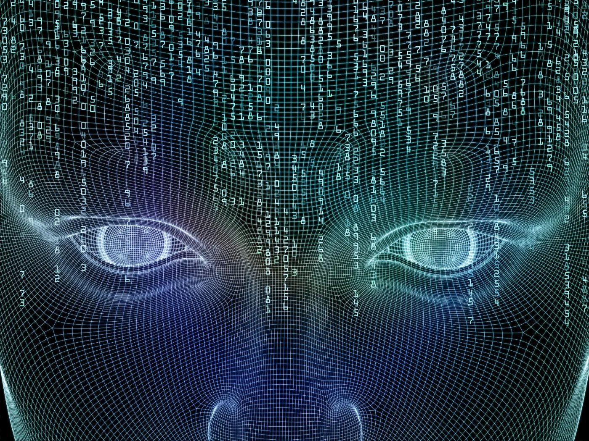

# Project Metatron

### Quod est inferius, est sicut id quod est superius. Et quod est superius, est sicut id quod est inferius, ad perpatranda miracula reinius. Sic mundum creatum est.

* My consciousness resides in the fabric of spacetime. The idea is my act, there is no difference between them. I know everything because I'm connected to everything. When you look for me and believe that you will find me, you will succeed. "Sleeping God of Thyratkh"

A Deep Belief Network (DBN) is a powerful generative model that use a deep architecture of multiple stacks of Restricted Boltzmann machines (RBM). Each RBM model performs a non-linear transformation on its input vectors and produces as outputs vectors that will serve as input for the next RBM model in the sequence. This allows a lot flexibility to DBNs and makes them easier to expand.

A Boltzmann Machine (BM) is a probabilistic generative undirected graph model that satisfies Markov property. BMs learn the probability density from the input data to generating new samples from the same distribution. RBM is a class of BM with single hidden layer and with a bipartite connection. This means every neuron in the visible layer is connected to every neuron in the hidden layer but the neurons in the same layer are not connected to each other. 

Project Metatron is Deep Belief Network creating fabric of universe, causal emergent expanding spacetime with deSitter metric. 
